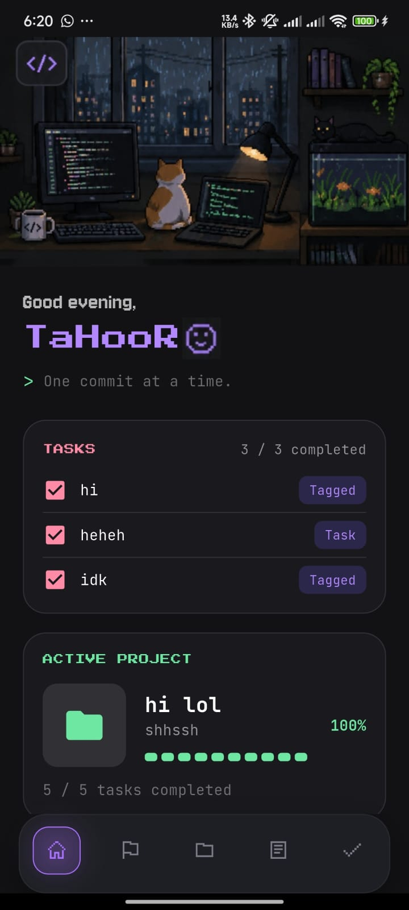
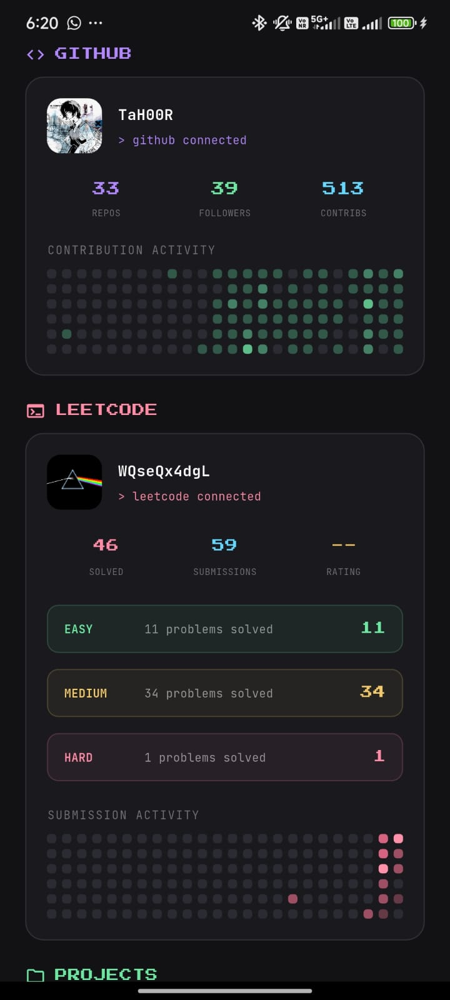
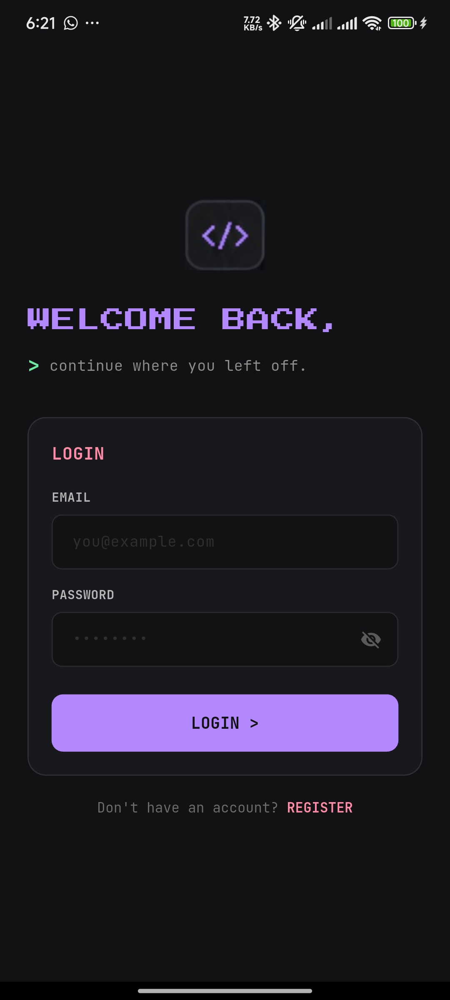
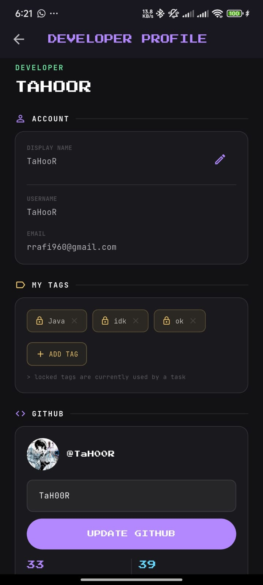
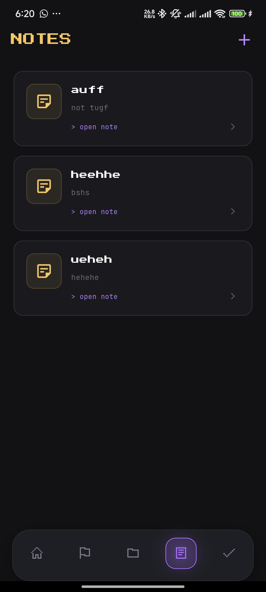
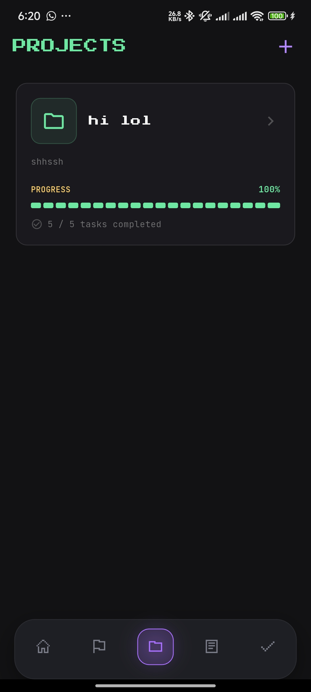
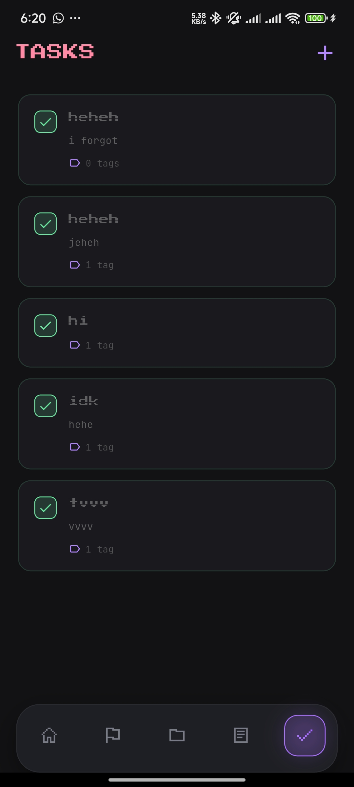
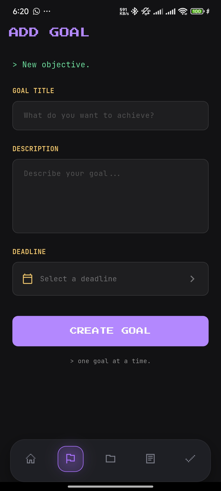

# DevTrack

> A full-stack developer productivity platform for tracking projects, tasks, goals, notes, and coding profiles, all in one place.

i built ts cz i was supposed to get paid 50/- by a friend...
and yes i love pain, so i used spring boot and postgresql for the backend, and flutter for the frontend.
and i love pixels, so i made a lot of pixels in the frontend.

## Features

* User registration and login
* Secure JWT-based authentication
* Persistent user sessions
* Project management
* Task tracking
* Goals and progress management
* Personal notes
* GitHub profile integration
* GitHub contribution graph
* LeetCode profile tracking
* Tags for organizing content
* Per-user data isolation and authorization
* Responsive Flutter frontend
* Spring Boot REST API backend (total pain btw)
* PostgreSQL database (pain x2)
* A lot of broken code and bugs (pain x3)
* A lot of pixels cz we all love pixels.

## Tech Stack

### Frontend

* Flutter
* Dart

### Backend

* Java
* Spring Boot
* Spring Security
* JWT Authentication
* BCrypt Password Hashing

### Database

* PostgreSQL

## Authentication & Security

it uses JSON Web Tokens (JWT), bare minimum btw i guess.

whats the point of this tho?

1. A user registers an account.
2. Passwords are securely hashed using BCrypt.
3. The user logs in with their credentials.
4. The backend generates a JWT.
5. The frontend stores the session locally.
6. The JWT is attached to authenticated API requests.
7. Spring Security validates the token before allowing access to protected resources.

all user-owned resources are protected so that users can only access and modify their own data.
yes you cant access other users' data, so dont even try.

## Screenshots

wait lemme pull up with a peak table for screenshots, i guess.
(i know not a single soul downloading ts, so screenshots are the only way to show off ts)

| Home | Contribution Graphs | Login | Profile |
|---------|---------|---------|---------
|  |  |  |  |

| Notes | Projects | Tasks | Goals |
|---------|---------|---------| --------|
|  |  |  |  |

## Core Modules

### Projects

Create and manage development projects.

### Tasks

Organize tasks within projects and track their progress.

### Goals

Set personal development goals and keep track of progress.

### Notes

Store notes and ideas associated with your development journey.

### GitHub Profile

Connect and display GitHub profile information, including contribution activity.

### LeetCode Profile

Track coding progress through LeetCode profile information,
the contest ratings not working i guess, but the problem solving stats are working fine.

## Project Structure

```text
DevTrack
├── frontend/          # Flutter application
│
└── backend/           # Spring Boot application
    ├── config/
    ├── controller/
    ├── dto/
    ├── entity/
    ├── repository/
    ├── security/
    └── service/
```

## Backend Architecture

The backend follows a layered architecture:

```text
Client
   │
   ▼
Controllers
   │
   ▼
Services
   │
   ▼
Repositories
   │
   ▼
PostgreSQL
```

Authentication requests pass through Spring Security and the JWT authentication filter before accessing protected endpoints.

## Getting Started

### Prerequisites

Make sure you have the following installed (please do):

* Flutter
* Java
* PostgreSQL
* Git

### Backend Setup

Clone the repository:

```bash
git clone https://github.com/TaH00R/devtrack
cd backend
```

Create a PostgreSQL database and configure your database credentials in:

```text
src/main/resources/application.properties
```

(please dont commit them on github)

Then run the Spring Boot application.

### Frontend Setup

Navigate to the Flutter project:

```bash
cd frontend
```

Install dependencies:

```bash
flutter pub get
```

Run the application:

```bash
flutter run
```

## Future Improvements

i will do all ts in winter break fs fs

* a growth tree (i was paid for ts btw)
* user profile picture upload (file_picker/image_picker kept crashing idk why)
* a lot of pixels cz we all love pixels.
* prolly deploy it cz im too lazy
* i have a lot of ideas for ts, but i will keep them to myself for now.
* might add docker/rate limiting for the backend

## Author

Built by **TaH00R**

If you found this project interesting, consider giving the repository a star and help me improve it.
